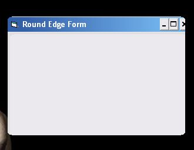



## round edge form

### Description

very simple to learn way of making a "round edged" form..nothing fancy, but totally simple. please comment or vote if you enjoy/hate this!
 
### More Info
 

             |
---                |---
**Submitted On**   |2005-08-27 20:26:04
**By**             |[coderNH](https://github.com/Planet-Source-Code/PSCIndex/blob/master/ByAuthor/codernh.md)
**Level**          |Beginner
**User Rating**    |5.0 (10 globes from 2 users)
**Compatibility**  |VB 6\.0
**Category**       |[Graphics](https://github.com/Planet-Source-Code/PSCIndex/blob/master/ByCategory/graphics__1-46.md)
**World**          |[Visual Basic](https://github.com/Planet-Source-Code/PSCIndex/blob/master/ByWorld/visual-basic.md)
**Archive File**   |[round\_edge1928228282005\.zip](https://github.com/Planet-Source-Code/codernh-round-edge-form__1-62364/archive/master.zip)

